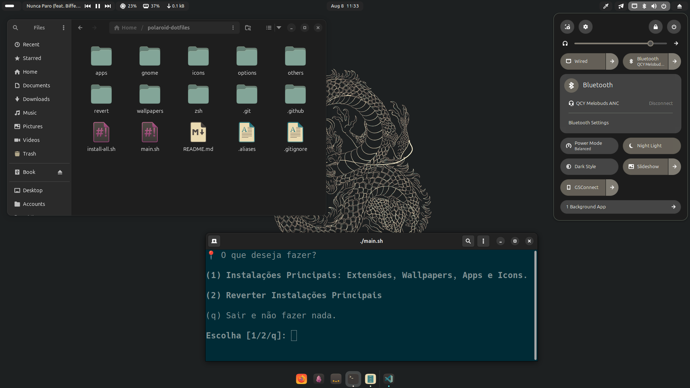
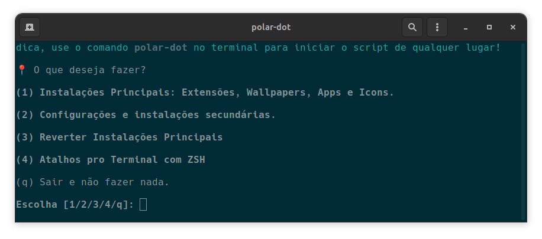
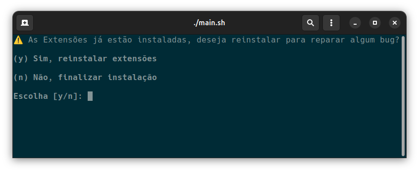
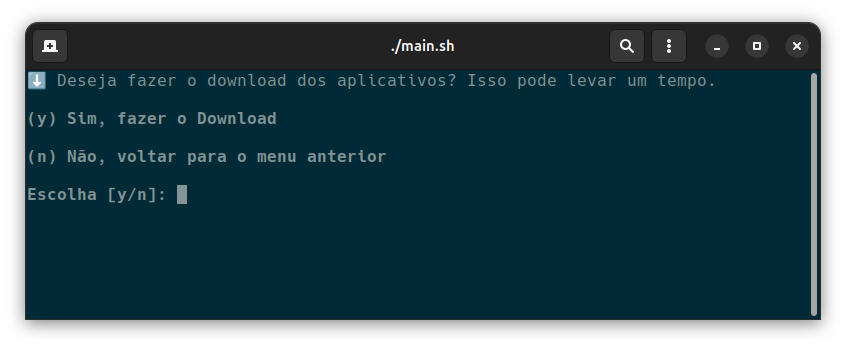

<h1 align="center">
	✨ Polaroid-Dotfiles ✨
    </br></br>
<p align="center">
  
  
  
</p>
    
</h1>

<div align = center>

&ensp;[<kbd>Instalação</kbd>](#-instalação)&ensp;
&ensp;[<kbd>Funcionalidades</kbd>](#-funcionalidades-principais)&ensp;

</div>

## ✍ Motivação

Este projeto é fruto do meu primeiro contato prático com Linux. Há cerca de 6 meses, iniciei minha jornada buscando um sistema operacional mais alinhado aos meus estudos em desenvolvimento web e programação em geral. Com o tempo, fui me aprofundando no ecossistema Linux e acabei me apaixonando pela flexibilidade, filosofia open source e pela comunidade vibrante.

Ao conhecer comunidades como a r/LinuxPorn, surgiu a vontade de personalizar ainda mais meu ambiente — no caso, o Ubuntu — para deixá-lo com a minha identidade visual. Durante esse processo, aprendi muito sobre Bash, automação e scripts de pós-instalação. O polaroid-dotfiles nasceu dessa necessidade: evitar retrabalho após reinstalações, mantendo minha estética e ferramentas favoritas com poucos comandos.

Tenho consciência de que o projeto tem limitações — como o foco exclusivo no Ubuntu 24.04 LTS com Wayland —, mas ele representa meu primeiro passo concreto na criação de soluções automatizadas para o desktop Linux. E acredito que ainda há muito mais por vir.

## 📖 O que é?

`polaroid-dotfiles` é um conjunto de scripts interativos que automatizam a configuração do seu ambiente **Ubuntu 24.04 LTS**, com foco em personalização visual e instalação de ferramentas de uso frequente. A ideia é reduzir o trabalho manual após formatações, proporcionando um setup rápido e padronizado.

## 🚀 Funcionalidades Principais

- **Instalação Modular via Menu**: Interface de terminal que guia o usuário na escolha das tarefas.
-  **Personalização Gruvbox**: Wallpapers, tema e ícones inspirados no estilo Gruvbox.
-  **Extensões GNOME**: Baixa, instala e, quando necessário, reinstala extensões para estilizar seu desktop.
-  **Instalação de Programas**: Baixa e instala aplicativos de uso diário.
-  **Mensagens de Confirmação**: Prompt antes de downloads, reinstalações ou alterações críticas.

## 🔄 Funcionalidades de Reversão

Caso queira desfazer alterações, há opções de remoção:

- **Apagar Tema Gruvbox** (ícones e cores)
-  **Apagar Wallpapers Gruvbox**
-  **Apagar Extensões GNOME**

> Não há script para desinstalar programas, pois essa parte exige decisões manuais do usuário.

## ⚙️ Pré-requisitos

- **Sistema**: Ubuntu 24.04 LTS (Wayland)
    
- **Permissões**: Acesso a `sudo`
    
- **Local de Instalação**: Pasta `~/polaroid-dotfiles`
    
- **Conexão com Internet**
    

## 💾 Instalação

1. No diretório Home (`~`), clone o repositório e ajuste permissões:
    
    ```
    cd ~
    git clone https://github.com/Pol4rLun4r/polaroid-dotfiles.git
    cd polaroid-dotfiles
    chmod +x main.sh
    ```
    
2. Execute o script principal:
    
    ```
    ./main.sh
    ```
    
3. **Reinício de Sessão**: Devido a limitações do Wayland, algumas tarefas (especialmente extensões GNOME) exigem reiniciar a sessão. O script indicará quando for necessário.

## 🎛️ Uso Interativo

Ao executar `./main.sh`, o **Menu Principal** apresenta as opções:


- **Confirmações**: Antes de cada ação, são exibidos prompts como:

    ou


Esses avisos evitam ações não intencionais e mantêm o controle do usuário.

## 🔍 Exemplos de Fluxo

1. Escolher **(1) Instalações Principais[...]** → confirmar **(y)** → entra no submenu
    
2. Escolher **(1)** para entrar no submenu das instalações → **(4) Baixar e Aplicar Tema e Ícones** → reiniciar sessão
    
3. Escolher **(2) Reverter Configurações** → selecionar ação desejada
    

## 🛠️ Futuras Funcionalidades

**As próximas melhorias planejadas incluem:**

- **Atalho global**: Configurar um comando `polar-dot` para executar o script de qualquer diretório do terminal.
    
- **Instalações secundárias**:
    
    - **Zsh e plugins**: Script para instalar Zsh e plugins populares (ex: oh-my-zsh, powerlevel10k).
    - **Terminal alternativo**: Instalação e configuração de um terminal como Alacritty.
    - **Fontes para Zsh**: Instalar fontes Nerd Fonts ou compatíveis para exibição de ícones.
    - **Fastfetch**: Script para instalar o Fastfetch.
    - **Alterar Ícone**: Ferramenta para alterar ícones dos apps que foram baixados através de pacotes Snap ou Flatpak.


## 🤝 Contribuição

Contribuições são bem-vindas:

1. Fork este repositório
    
2. Crie uma branch de feature (`git checkout -b feature/descricao`)
    
3. Faça commits com emojis seguindo o padrão do projeto
    
4. Abra um Pull Request
    

## 📄 Licença

Licenciado sob a MIT [License](LICENSE).